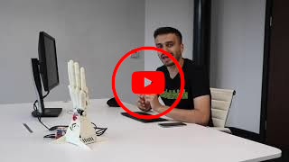

# Maintainership of this project has finished

For any questions please contact info@robotnanohand.com

# Hamsa

Hamsa is the software required to control a robot hand built by [The Robot Studio](https://www.therobotstudio.com/), developed in collaboration with [Silicon Highway](https://www.siliconhighwaydirect.com/). It is designed to run on linux. The software consists in a cpp library (that communicates with the servos over serial) and python bindings for said library.

Hamsa also contains a python module for running a mimicking demo, where the robot hand can copy one of [five gestures](https://github.com/NVIDIA-AI-IOT/trt_pose_hand/blob/main/images/gesture_classification.gif) that it sees through the camera:
* Stop (open palm)
* Fist
* OK
* Peace
* Pan (index pointing)

In what follows we explain how to install hamsa, run the demo and also use the firmware to control the hand more generally. We have also created a video tutorial where we run through these first two sections:

[](http://www.youtube.com/watch?v=IdFhGY28z0I "Video Tutorial")

## Calibration preparation

Before we begin installing the software on the jetson, we must first note down what servo positions correspond to the movement ranges of the fingers. In other words, what servo positions corresponds to the little finger:

* fully curled 
* fully extended
* fully to the left
* fully to the right

and similarly for the other fingers/thumb. We will also need to note down the IDs of each servo. All this is easiest to do using the FD SCServo Debug GUI that you used earlier when building the hand. Plug your hand into the windows machine and follow the instructions in [docs/servo_calibration.md](docs/servo_calibration.md).

The servo positions that you note down will then be used in "Firmware calibration" to update the firmware.

## Installation

For the mimicking demo, in order to detect what gesture the hand sees before it, we use the [trt_pose_hand](https://github.com/NVIDIA-AI-IOT/trt_pose_hand) model (see [docs/Attributions.md](docs/Attributions.md) for license and copyright notice). This depends on [trt_pose](https://github.com/NVIDIA-AI-IOT/trt_pose) (which itself has a tree of dependencies). To use the CSI camera we will also need [jetcam](https://github.com/NVIDIA-AI-IOT/jetcam) and to open the notebooks we need to install [JupyterLab](https://jupyter.org/). 

We have created an image of the nano JetPack 4.5.1 with the above packages already installed. Please download the latest version from [here](https://nx20440.your-storageshare.de/s/mBeDso6rkKK9o3f) and flash it onto a 32 GB (or higher) SD card using a tool such as [Etcher](https://www.balena.io/etcher/). 

After flashing it, pop the SD card into the jetson nano and boot it up. Plug in a keyboard, mouse and monitor directly into the jetson and then follow the on-screen prompts to setup the OS (in principle you could also do this in [headless mode](https://www.jetsonhacks.com/2019/08/21/jetson-nano-headless-setup/)). Having done this you should then be able to find `hamsa` (and `trt_pose_hand`) in the directory `robothand`, which will be in your home directory.

See [docs/verify_image.md](docs/verify_image.md) to verify that your download was safe and successful.

See [docs/disk_image.md](docs/disk_image.md) for how to reproduce this image.

### Firmware calibration

At this point we will need to update the hamsa config file
with your values noted down from [servo calibration](docs/servo_calibration.md). This config file is located at `~/robothand/hamsa/hamsa.config`. Here the `~` means your home directory. So, for example, if your username is jeff then the config file will be at `/home/jeff/robothand/hamsa/hamsa.config`.

The config file is divided into sections, one for each servo (and so two for each finger plus the wrist). Fill out the values in each section.

## Setting up the hand
Power the servos by plugging in the barrel connector to the URT-1 board. Connect the URT-1 board to the jetson using a microUSB to USB cable. If you have successfully powered the servos then the board will have one light shining, else it will be two.

Boot up (or reboot) the jetson. The hand should now appear at `/dev/ttyUSB0`.

Check that everything is working by running the pose sequence:

```bash
cd ~/robothand/hamsa/src
python3 hamsa/poses.py
```

## Demo

In this section we explain how to implement the mimicking demo, where the robot hand will copy a gesture that it views through the camera. If you do not intend on running the demo you can skip ahead to the [Hamsa](#hamsa-1) section to see how to use hamsa to control the hand more generally. 

Note: the performance of the image recognition model seems to depend quite heavily on the lighting and background to the human hand. See [docs/image_recognition.md](docs/image_recognition.md) for some examples. 

Before we get started with the demo there is one last thing to be done. As documented on the [trt_pose_hand](https://github.com/NVIDIA-AI-IOT/trt_pose_hand) site, we must download the model weight from [here](https://drive.google.com/file/d/1NCVo0FiooWccDzY7hCc5MAKaoUpts3mo/view?usp=sharing) and then move it to the following directory: `~/robothand/trt_pose_hand/model/`. This moving can be done, for example, with the following command:
```bash
cp ~/Downloads/hand_pose_resnet18_att_244_244.pth ~/robothand/trt_pose_hand/model
```

You can either run the mimicking demo from the console or within a jupyter notebook.  

### Console

Open up a terminal and then open a python console with the following command:  
```bash
python3
```
Now import the firmware and the mimicing demo from hamsa:
```python
from hamsa import mimic, firmware
```
Before we can run mimic we need to setup a few things, 
first we shall get an instance of the model (this takes a few
minutes to load).  
**Note** this command requires internet access. 
**Note 2** this will consume almost all physical memory, causing 
any GUI window to perform slow
```python
hand_model = mimic.get_pose_model()
```
Then we setup the camera
```python
camera_and_container = mimic.get_camera_and_container(hand_model)
```
And finally run mimic! This will activate the camera and begin detecting any hand poses it sees. If it sees one of the five listed above the robot hand will mimic that pose.
```python
mimic.run_mimic(hand_model, camera_and_container)
```
When you are done run `Ctl+C` to stop the command.  

Whilst the command is running you will probably want to view what the camera sees. To do this run the following in a separate terminal:

```bash
feh -R 1 ~/robothand/hamsa/jetcam.jpeg
```

We specify a low refresh rate of 1 s (using `-R 1`) to try and avoid memory issues.

### Notebook
To run the mimicking demo from the notebook, open it up:
```bash
jupyter notebook ~/robothand/hamsa/notebooks/gesture_mimick.ipynb
```
Run each cell in order. The final one actually initiates the demo.


## Hamsa
For those of you who wish to go beyond the mimicking demo, we detail here how to use hamsa more generally.

We must first import the `hand` submodule from `hamsa`:
```python
from hamsa import hand
```

Each finger has two servos associated with it: one for curling it and one for wiggling it (i.e. moving it from side-to-side). Let's consider each in turn.

### Curling
Hamsa provides a seperate function for curling each finger. These functions following the naming scheme <code>curl_<em>finger</em></code> where <em>finger</em> is to be replaced by one of the following:
  * thumb
  * index
  * middle
  * ring
  * pinky

These functions take two arguments: the ratio by which the finger should be curled and how long the curl should take. The former varies between 0 and 1 (with 1 being fully outstretched) and the latter is given in milliseconds.

So for example, to fully curl the pinky finger inwards in 1.5 s run:

```python
hand.curl_pinky(0, 1500)
```
or to the curl the middle finger halfway in 0.7 s run:
```python
hand.curl_middle(0.5, 700)
```
### Wiggling
The syntax for wiggling is the same as curling but now the functions are labelled as <code>wiggle_<em>finger</em></code>. In the first argument, 0 corresponds to the finger being fully to the left (i.e. furthest away from the thumb) and 1 to the right.

So for example, to wiggle the middle finger fully to the left in 0.65 s run:

```python
hand.wiggle_middle(0, 650)
```

or to wiggle the index 70% to the right in 2 s run:

```python
hand.wiggle_index(.7, 2000)
```
### Wrist
Finally there is a function for curling the wrist. It follows the same syntax as the previous functions: 0 corresponds to fully forwards and 1 corresponds to fully back.

For example, to curl the wrist 70% back in 2.5 s, run:
```python
hand.curl_wrist(0.7, 2500)
```
