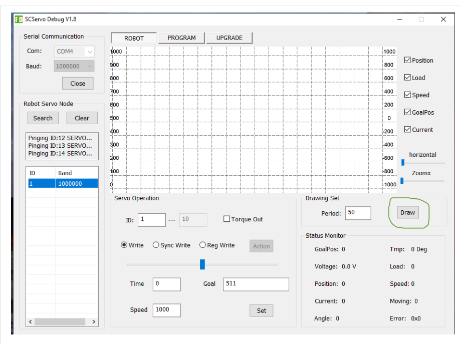
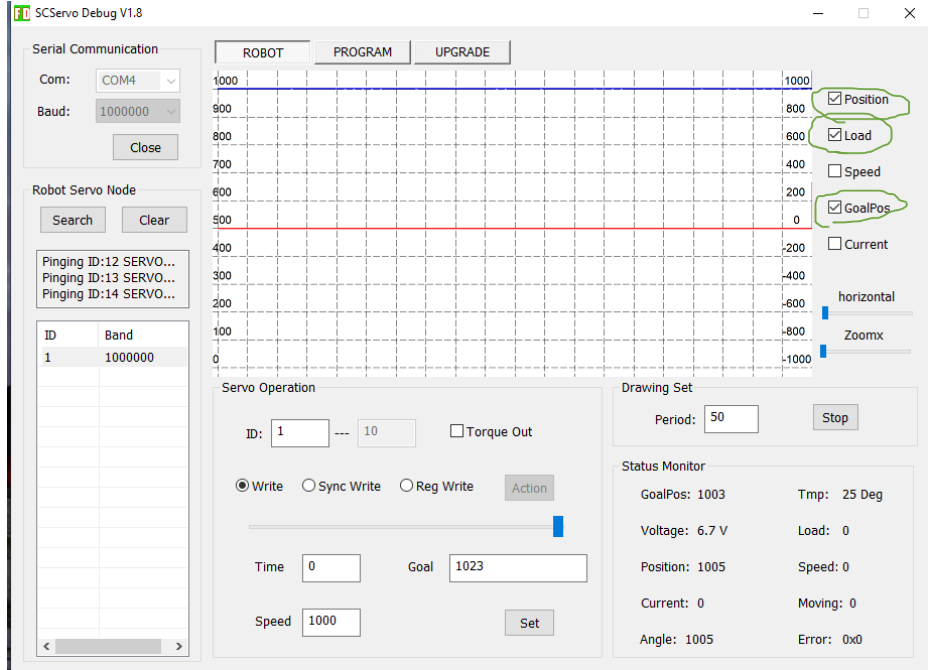
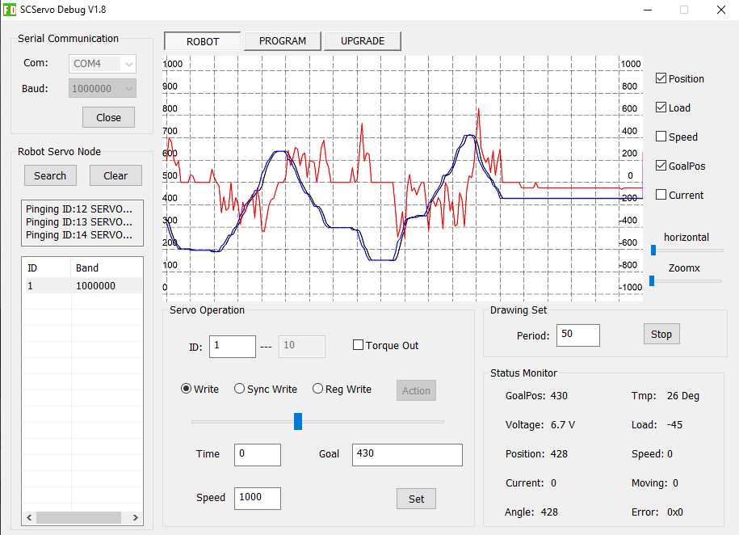
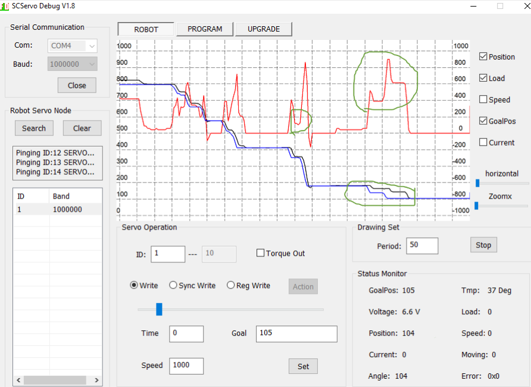
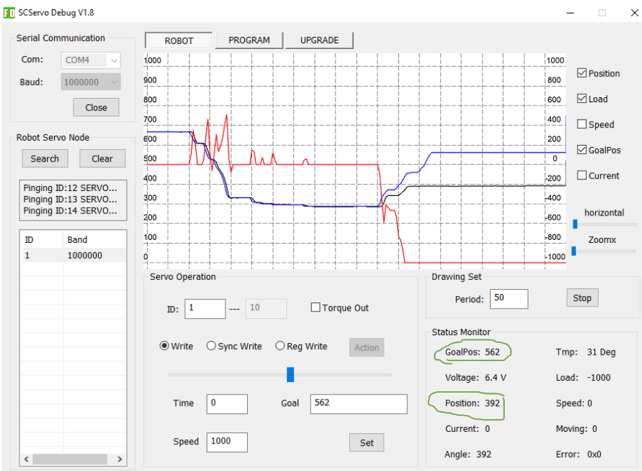

We found the easiest way to determine the range of motion was
using the FD SCServo Debug GUI in Windows.
Using the draw feature in the software we can monitor servo
metrics over time.

The metrics we care about are Load (red, right axis), position 
(black, left axis), and goal position (blue, left axis)

As we move the goal position we will see the load moving up and 
down as the servo moves, this is normal even when the servo is 
not connected to a finger.  
**Note** depending on the direction of the load, the GUI can 
display the load as either positive or negative.

When connected to a finger you may see the finger stutter as it 
moves, this will be due to it catching slight print inconsistencies
and will result in a slightly different graph.  
e.g. the servo moves a bit and gets caught, the load increases
as the gap between goal and current position increase, then the 
load suddenly drops as the finger jumps forwards, overcoming the 
additional friction at that point.

However once the finger has reached the limit you will see a much 
more stable load. The load value will only move further from 0 as the 
goal position is moved further away from the limit position.
At this point, write down the current position. We will use this as 
the limit and add it to a file in `hamsa` later.  
**Note** to help reduce stress on the servos once you have reached 
the limit try moving the goal position back closer to the position 
to reduce the load and therefore the stress and heat of the servo. 

We need these positions for the left, right, fully curled and fully
extended of each finger.
Left is furthest away from thumb. Also, please note down the IDs of 
each servo along with which finger they correspond to and whether or not
they correspond to 'wiggling' or 'curling'.

You may find the curl servos use their full range, however the sideways 
movement will not.

Having done this you will also need to determine the upper and lower 
limits for the wrist servo too, using a similar approach.

